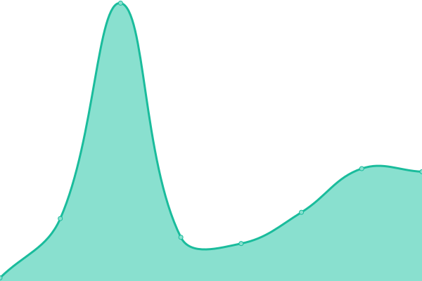
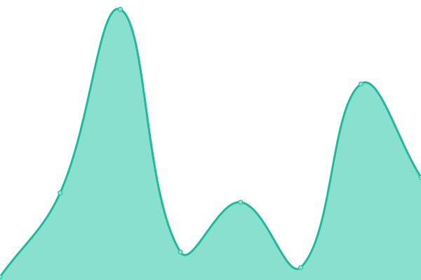
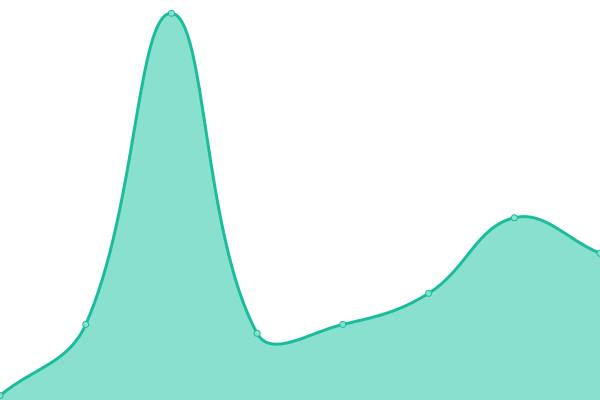

# [📈 Live Status](https://37397398371280.github.io/Website-Status): <!--live status--> **🟩 All systems operational**

This repository contains the open-source uptime monitor and status page for [37397398371280](https://37397398371280.github.io/Website-Status), powered by [Upptime](https://github.com/upptime/upptime).

With [Upptime](https://upptime.js.org), you can get your own unlimited and free uptime monitor and status page, powered entirely by a GitHub repository. We use [Issues](https://github.com/37397398371280/Website-Status/issues) as incident reports, [Actions](https://github.com/37397398371280/Website-Status/actions) as uptime monitors, and [Pages](https://37397398371280.github.io/Website-Status) for the status page.

<!--start: status pages-->
<!-- This summary is generated by Upptime (https://github.com/upptime/upptime) -->
<!-- Do not edit this manually, your changes will be overwritten -->
<!-- prettier-ignore -->
| URL | Status | History | Response Time | Uptime |
| --- | ------ | ------- | ------------- | ------ |
|  [Home Page](https://game-idiots.github.io/website/) | 🟩 Up | [home-page.yml](https://github.com/37397398371280/Website-Status/commits/HEAD/history/home-page.yml) | 

 73ms
     
 | 

<a href="https://37397398371280.github.io/Website-Status/history/home-page">100.00%</a>
    

|  [Soundboard Page](https://game-idiots.github.io/website/sb.html) | 🟩 Up | [soundboard-page.yml](https://github.com/37397398371280/Website-Status/commits/HEAD/history/soundboard-page.yml) | 

 24ms
     
 | 

<a href="https://37397398371280.github.io/Website-Status/history/soundboard-page">100.00%</a>
    

|  [Thermal](https://game-idiots.github.io/website/thermal.html) | 🟩 Up | [thermal.yml](https://github.com/37397398371280/Website-Status/commits/HEAD/history/thermal.yml) | 

 24ms
     
 | 

<a href="https://37397398371280.github.io/Website-Status/history/thermal">100.00%</a>
    

|  [Code Playground](https://game-idiots.github.io/website/Code-Playground.html) | 🟩 Up | [code-playground.yml](https://github.com/37397398371280/Website-Status/commits/HEAD/history/code-playground.yml) | 

 30ms
     
 | 

<a href="https://37397398371280.github.io/Website-Status/history/code-playground">100.00%</a>
    

|  [Today's Security Code](https://game-idiots.github.io/website/Todays-Security-Code.html) | 🟩 Up | [today-s-security-code.yml](https://github.com/37397398371280/Website-Status/commits/HEAD/history/today-s-security-code.yml) | 

 26ms
     
 | 

<a href="https://37397398371280.github.io/Website-Status/history/today-s-security-code">100.00%</a>
    

|  [Soundboard Plans](https://game-idiots.github.io/website/Soundboard-Plans.html) | 🟩 Up | [soundboard-plans.yml](https://github.com/37397398371280/Website-Status/commits/HEAD/history/soundboard-plans.yml) | 

 75ms
     
 | 

<a href="https://37397398371280.github.io/Website-Status/history/soundboard-plans">100.00%</a>
    

|  [Abandoned Server](https://game-idiots.github.io/website/Abandoned-Server.html) | 🟩 Up | [abandoned-server.yml](https://github.com/37397398371280/Website-Status/commits/HEAD/history/abandoned-server.yml) | 

 27ms
     
 | 

<a href="https://37397398371280.github.io/Website-Status/history/abandoned-server">100.00%</a>
    

|  [Leaks Page](https://game-idiots.github.io/website/Leaks/Leaks.html) | 🟩 Up | [leaks-page.yml](https://github.com/37397398371280/Website-Status/commits/HEAD/history/leaks-page.yml) | 

 20ms
     
 | 

<a href="https://37397398371280.github.io/Website-Status/history/leaks-page">100.00%</a>
    

|  [Self Destruct](https://game-idiots.github.io/website/Self-Destruct.html) | 🟩 Up | [self-destruct.yml](https://github.com/37397398371280/Website-Status/commits/HEAD/history/self-destruct.yml) | 

 29ms
     
 | 

<a href="https://37397398371280.github.io/Website-Status/history/self-destruct">100.00%</a>
    

|  [Self Destruct (Past)](https://game-idiots.github.io/website/Past/Self-Destruct-Past.html) | 🟩 Up | [self-destruct-past.yml](https://github.com/37397398371280/Website-Status/commits/HEAD/history/self-destruct-past.yml) | 

 24ms
     
 | 

<a href="https://37397398371280.github.io/Website-Status/history/self-destruct-past">100.00%</a>
    

|  [Self Destruct (Future)](https://game-idiots.github.io/website/Future/Self-Destruct-Future.html) | 🟩 Up | [self-destruct-future.yml](https://github.com/37397398371280/Website-Status/commits/HEAD/history/self-destruct-future.yml) | 

 23ms
     
 | 

<a href="https://37397398371280.github.io/Website-Status/history/self-destruct-future">100.00%</a>
    

<!--end: status pages-->

[**Visit our status website →**](https://37397398371280.github.io/Website-Status)

## 📄 License

- Powered by: [Upptime](https://github.com/upptime/upptime)
- Code: [MIT](./LICENSE) © [Anand Chowdhary](https://anandchowdhary.com), supported by [Pabio](https://pabio.com)
- Data in the `./history` directory: [Open Database License](https://opendatacommons.org/licenses/odbl/1-0/)
